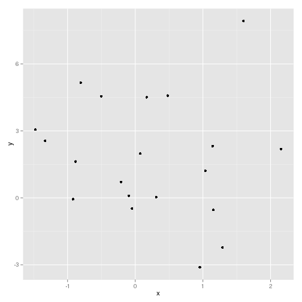

Datos y comandos básicos
========================================================
author: José Manuel Proudinat Silva
font-import: http://fonts.googleapis.com/css?family=Risque
font-family: 'Risque'
jmps2812@gmail.com

GitHub: JosmanPS

www.datata.mx


Un poquito de datos
=======================
type: sub-section


Tipos de datos más comunes
======================
- CSV
- XML
- JSON
- XLSX (Por favor, nunca en la vida)


CSV
=====================
- *Comma Separated Value*
- No siempre son comas
- Tablas de datos
- Con este tipo de datos trabajaremos en el curso
- Se puede trabajar por partes
- Bases de datos relacionales
- MySQL, Postgres, ...


Ejemplo CSV
===========================
<small>
`nombre, apellido, carrera`

`Josman, Proudinat, Matemáticas Aplicadas`
</small>


XML
=====================
- *Xtensible Markup Languague*
- El esquema (descripción) de los datos va dentro de los datos.
- Fácil de convertir
- Lenguaje estilo HTML


Ejemplo XML
===========================
<small>
```{xml}
<xml>
<alumno>
  <nombre>
    <primerNombre>José</primerNombre>
    <segundoNombre>Manuel</segundoNombre>
    <apellidos>
      <paterno>Proudinat</paterno>
      <materno>Silva</materno>
    </apellidos>
  <carrera>Matemáticas Aplicadas</carrera>
</alumno>
</xml>
```
</small>


JSON
==============================
- *JavaScript Object Notation*
- <3
- Muy útil para desarrollo de aplicaciones
- Muy común en APIs
- Bases de datos no-relacionales
- MongoDB, CouchDB, ...


Ejemplo JSON
==============================
<small>
```{json}
  {
  "nombre": "Josman"
  "apellido": "Proudinat"
  "carrera": "Matemáticas Aplicadas"
  }
```
</small>


Comandos básicos
=================================
type: sub-section


Directorio de trabajo
================
Antes que nada, siempre es importante especificar el directorio donde se guardará nuestro trabajo.

```r
# Para ver en qué directorio nos encontramos actualmente
getwd()
```

```
[1] "/home/Josman/Projects/Curso-R-ITAM-2015/Lectura02"
```

```r
# Para especificar un directorio de trabajo distinto
setwd("~/Projects/Curso-R-ITAM-2015/Lectura02/")
```

Asignación de variables e impresión
========

Para asginar variables utilizamos <-, también podemos usar "=" pero espreferible la primera manera

```r
text <- "El valor de Pi es: "
value <- pi
```

R es lenguaje orientado a objetos, donde cada variable es un objeto con una clase específica. Las clases de los objetos determinan qué funciones pueden aplicarse a ellos.

```r
class(text)
```

```
[1] "character"
```

=========

```r
class(value)
```

```
[1] "numeric"
```

Cuando queremos imprimir el valor de una variable podemos usar la función `print()`o simplemento escribir el nombre de la variable.

```r
print(value)
```

```
[1] 3.141593
```

```r
value
```

```
[1] 3.141593
```

========
Podemos imprimir múltiples variables del siguiente modo:

```r
print(text); print(value)
```

```
[1] "El valor de Pi es: "
```

```
[1] 3.141593
```

```r
cat(text, value, "\n")
```

```
El valor de Pi es:  3.141593 
```

=========
Si queremos conocer todas las variables que tenemos en nuestro entorno usamos la siguiente función:

```r
ls()
```

```
[1] "text"  "value"
```
O simplemente observamos en la ventana Envrionment de RStudio.

=========
Si queremos eliminar alguna variable en el entorno, utilizamos la función `rm()`.

```r
rm("value")
ls() # Observamos que la variable value ya no aparece
```

```
[1] "text"
```

Vectores
=======================
Para crear vectores utilizamos la función `c()`.

```r
c(1, 2, 3) # Vector numérico
```

```
[1] 1 2 3
```

```r
c("apple", "orange", "banana") # Vector de caracteres
```

```
[1] "apple"  "orange" "banana"
```

```r
c(TRUE, FALSE, FALSE) # Vector de tipo booleano
```

```
[1]  TRUE FALSE FALSE
```

===============
Podemos unir vectores con la misma función `c()`.

```r
v1 <- c(1, 2, 3)
v2 <- c(4, 5, 6)
c(v1, v2)
```

```
[1] 1 2 3 4 5 6
```

```r
v1 <- c("A", "B", "C")
v2 <- c(1, 2, 3)
c(v1, v2)
```

```
[1] "A" "B" "C" "1" "2" "3"
```

Algunas funciones básicas
===================

```r
# Generamos datos a partir de una distribución normal
x <- rnorm(n = 20)
x <- rnorm(20) # Default: mean = 0, sd = 1
y <- rnorm(n = 20, mean = 2, sd = 3)
```

====

```r
# Cargamos un paquete
library("ggplot2")
qplot(x, y) # Gráfica rápida del paquete ggplot2
```

 

====

```r
mean(x) # media
```

```
[1] 0.2049606
```

```r
median(x) # mediana
```

```
[1] 0.1205104
```

```r
var(x) # varianza
```

```
[1] 1.028761
```

========

```r
sd(x) # desviación estándar
```

```
[1] 1.014279
```

```r
cor(x, y) # Correlación
```

```
[1] -0.1027475
```

```r
cov(x, y) # Covarianza
```

```
[1] -0.2788541
```

Comparaciones entre vectores
===================
A la hora de hacer operadores lógicos necesitamos saber como comparar vectores. Para ello es necesario conocer los operadores lógicos en R y algunas funciones que nos simplificaran muchas comparaciones.

```r
# Operadores lógicos
x <- 1
x == 0 # Igualdad
```

```
[1] FALSE
```

```r
x != 0 # Desigualdad
```

```
[1] TRUE
```

=======

```r
x < 0 # Menor que
```

```
[1] FALSE
```

```r
x > 0 # Mayor que
```

```
[1] TRUE
```

```r
x <= 0
```

```
[1] FALSE
```

```r
x >= 0
```

```
[1] TRUE
```

=========
Ahora veamos qué sucede con vectores.

```r
x <- c("A", "B", "C")
y <- c("A", "C", "B")
x == y
```

```
[1]  TRUE FALSE FALSE
```

```r
x != y
```

```
[1] FALSE  TRUE  TRUE
```

```r
x < y
```

```
[1] FALSE  TRUE FALSE
```

=========

```r
x > y
```

```
[1] FALSE FALSE  TRUE
```

```r
x <= y
```

```
[1]  TRUE  TRUE FALSE
```

```r
x >= y
```

```
[1]  TRUE FALSE  TRUE
```

=========

```r
# Si nos interesa saber si algun elemento coinciden
any(x == y)
```

```
[1] TRUE
```

```r
# Si queremos saber si todos los elementos coinciden
all(x == y)
```

```
[1] FALSE
```


Operaciones con datos
===============

```r
data() # Nos muestra los sets de datos de muestra que trae R
```

```r
data(USArrests) # LLamamos a los datos
data <- USArrests # Asignamos los datos a la variable 'data'
head(data) # Vemos los primeros valores de la base
```

```
           Murder Assault UrbanPop Rape
Alabama      13.2     236       58 21.2
Alaska       10.0     263       48 44.5
Arizona       8.1     294       80 31.0
Arkansas      8.8     190       50 19.5
California    9.0     276       91 40.6
Colorado      7.9     204       78 38.7
```


Importar/Exportar datos
============================

```r
# Exportamos los datos
write.csv(data, "./data/USArrests.csv")

# Leemos 5 líneas para ver su estructura
readLines("./data/USArrests.csv", 5)
```

```
[1] "\"\",\"Murder\",\"Assault\",\"UrbanPop\",\"Rape\""
[2] "\"Alabama\",13.2,236,58,21.2"                     
[3] "\"Alaska\",10,263,48,44.5"                        
[4] "\"Arizona\",8.1,294,80,31"                        
[5] "\"Arkansas\",8.8,190,50,19.5"                     
```

```r
# Importamos datos
data <- read.csv('./data/USArrests.csv', head = T, row.names = 1)
```


=============================

```r
head(data)
```

```
           Murder Assault UrbanPop Rape
Alabama      13.2     236       58 21.2
Alaska       10.0     263       48 44.5
Arizona       8.1     294       80 31.0
Arkansas      8.8     190       50 19.5
California    9.0     276       91 40.6
Colorado      7.9     204       78 38.7
```


Apply
==============
Cuando queremos aplicar funciones a estructuras de datos más sofisticadas que vectores, usamos la función `apply()`.

```r
# Aplicamos algunas funciones a los datos
apply(data, 2, mean) 
```

```
  Murder  Assault UrbanPop     Rape 
   7.788  170.760   65.540   21.232 
```

```r
# El valor 2 en apply() indica que queremos aplicar la función a las columnas, si escribieramos 1, indicaría que se aplica a los renglones 
```


Varianzas, Correlaciones
===========

```r
var(data) # Matriz de varianzas y covarianzas
```

```
             Murder   Assault   UrbanPop      Rape
Murder    18.970465  291.0624   4.386204  22.99141
Assault  291.062367 6945.1657 312.275102 519.26906
UrbanPop   4.386204  312.2751 209.518776  55.76808
Rape      22.991412  519.2691  55.768082  87.72916
```

```r
cor(data) # Matriz de correlaciones
```

```
             Murder   Assault   UrbanPop      Rape
Murder   1.00000000 0.8018733 0.06957262 0.5635788
Assault  0.80187331 1.0000000 0.25887170 0.6652412
UrbanPop 0.06957262 0.2588717 1.00000000 0.4113412
Rape     0.56357883 0.6652412 0.41134124 1.0000000
```


Secuencias
=============
Las secuencias son muy importantes ya que nos permiten tener mejor control de los índices en matrices y vectores. Mostraremos unos ejemplos:

```r
# Secuencia simple
seq(from = 1, to = 10)
```

```
 [1]  1  2  3  4  5  6  7  8  9 10
```

```r
# Lo anterior es equivalente a hacer
1:10
```

```
 [1]  1  2  3  4  5  6  7  8  9 10
```

===========
Si queremos que el intervalo entre cada elemento sea distinto de 1, necesitamos hacer lo siguiente:

```r
seq(from = 1, to = 11, by = 2)
```

```
[1]  1  3  5  7  9 11
```

=============
La función `rep()`es muy útil a la hora de escribir secuencias que se repitan.

```r
# Repetir un elemento
rep(1, times = 10)
```

```
 [1] 1 1 1 1 1 1 1 1 1 1
```

```r
# Podemos repetir un vector o secuencia
rep(c(1,2,3), times = 3)
```

```
[1] 1 2 3 1 2 3 1 2 3
```

=========

```r
# Podemos hacer que cada elemento de un vector o secuencia se repitan 
rep(c(1,2,3), each = 3)
```

```
[1] 1 1 1 2 2 2 3 3 3
```

```r
# Podemos crear una secuencia de un valor a otro indicando el tamaño
seq(from = 1, to = 2, length.out = 5)
```

```
[1] 1.00 1.25 1.50 1.75 2.00
```

Selección de elementos en vectores y matrices
=============
En esta sección mostraremos distintas formas de seleccionar muestras de vectores y matrices segun la tarea o la necesidad que tengamos. Primero veremos como funciona con **vectores**:

```r
pares <- 2 * 1:10 # Creamos un vector

# Vemos algunos de sus elementos individuales. Para esto solo indicamos en un [ ] el valor que deseamos
pares[1]
```

```
[1] 2
```

====

```r
pares[2]
```

```
[1] 4
```
Podemos obtener múltiples valores, indicando una secuencia de las posiciones o un vector indicador:

```r
pares[1:3]
```

```
[1] 2 4 6
```

```r
pares[c(2, 3, 6)]
```

```
[1]  4  6 12
```

========
Podemos también indicar que valores sean los que no se muestran del total de elementos, indicando las posiciones en valor negativo.

```r
pares[-1]      # Quita el primer elemento
```

```
[1]  4  6  8 10 12 14 16 18 20
```

```r
pares[- (1:3)] # Quita los primeros 3 elementos
```

```
[1]  8 10 12 14 16 18 20
```

```r
pares[- c(2, 3, 6)] # Quita los elementos indicados
```

```
[1]  2  8 10 14 16 18 20
```

========
También se puede indicar que valores queremos ver a través de vectores lógicos.

```r
pares > 10
```

```
 [1] FALSE FALSE FALSE FALSE FALSE  TRUE  TRUE  TRUE  TRUE  TRUE
```

```r
pares[pares > 10]
```

```
[1] 12 14 16 18 20
```


str
========
Haciendo un poco más de estadística, retomemos la base de datos que teníamos anteriormente:

```r
str(data)
```

```
'data.frame':	50 obs. of  4 variables:
 $ Murder  : num  13.2 10 8.1 8.8 9 7.9 3.3 5.9 15.4 17.4 ...
 $ Assault : int  236 263 294 190 276 204 110 238 335 211 ...
 $ UrbanPop: int  58 48 80 50 91 78 77 72 80 60 ...
 $ Rape    : num  21.2 44.5 31 19.5 40.6 38.7 11.1 15.8 31.9 25.8 ...
```


summary
=====
Tomaremos un vector de nuestra base de datos y seleccionaremos elementos que nos interesan de él con un enfoque más estadístico:

```r
murder <- data$Murder  # Seleccionamos el vector de datos 'murder'
summary(murder)
```

```
   Min. 1st Qu.  Median    Mean 3rd Qu.    Max. 
  0.800   4.075   7.250   7.788  11.250  17.400 
```

=======

```r
murder[murder > mean(murder)] # Valores mayores que la media
```

```
 [1] 13.2 10.0  8.1  8.8  9.0  7.9 15.4 17.4 10.4  9.7 15.4 11.3 12.1 16.1
[15]  9.0 12.2 11.4 11.1 13.0 14.4 13.2 12.7  8.5
```

```r
murder[murder > median(murder)] # Valores mayores que la mediana
```

```
 [1] 13.2 10.0  8.1  8.8  9.0  7.9 15.4 17.4 10.4  9.7 15.4 11.3 12.1 16.1
[15]  9.0 12.2  7.4 11.4 11.1 13.0  7.3 14.4 13.2 12.7  8.5
```

Cuantiles
=======

```r
# Valores en el primer o último decil
murder[murder < quantile(murder, 0.1) | murder > quantile(murder, 0.9)] # Notar que usamos | como 'or'
```

```
 [1] 15.4 17.4  2.2 15.4  2.1 16.1  2.1  0.8 14.4  2.2
```

```r
# Valores entre el tercer y quinto decil
murder[murder > quantile(murder, 0.3) & murder < quantile(murder, 0.5)]
```

```
 [1] 5.9 5.3 7.2 6.0 6.0 6.6 4.9 6.3 5.7 6.8
```

Valores faltantes
=====

```r
# Añadiremos algunos valores faltantes
murder[c(1, 3, 9, 32, 48, 11, 21, 30)] <- NA

# Podemos usar la selección de elementos para quitar los valores faltantes o valores nulos
murder[!is.na(murder) & !is.null(murder)]  # El signo ! indica que se tome el valor lógico contrario, en este caso no queremos saber los valores faltantes o nulos, sino los que no lo son, por eso usamos !
```

```
 [1] 10.0  8.8  9.0  7.9  3.3  5.9 17.4  2.6 10.4  7.2  2.2  6.0  9.7 15.4
[15]  2.1 11.3 12.1  2.7 16.1  9.0  6.0  4.3 12.2  2.1 11.4 13.0  0.8  7.3
[29]  6.6  4.9  6.3  3.4 14.4  3.8 13.2 12.7  3.2  2.2  8.5  4.0  2.6  6.8
```

======
A la hora de hacer selección de elementos en matrices o bases de datos, se aplica la misma lógica que cuando se hace con vectores. La diferencia radica en que las matrices tienen posiciones del estilo [i,j] de sus elementos.

```r
# Algunos ejemplos
data[15, 3] # Nos da el valor del individuo 15 en la variable 3
```

```
[1] 57
```

```r
# Podemos seleccionar una columna completa
data[ ,2]
data[ ,c(2,3)] # Más de una columna
```

=====

```r
# Seleccionamos un grupo de individuos
data[1:5, ]  # Los primeros 5 individuos
```

```
           Murder Assault UrbanPop Rape
Alabama      13.2     236       58 21.2
Alaska       10.0     263       48 44.5
Arizona       8.1     294       80 31.0
Arkansas      8.8     190       50 19.5
California    9.0     276       91 40.6
```

```r
data[1:5, c(2,4)] # Los primeros 5 individuos y solo las variables 2 y 4
```

```
           Assault Rape
Alabama        236 21.2
Alaska         263 44.5
Arizona        294 31.0
Arkansas       190 19.5
California     276 40.6
```

====

```r
# Podemos seleccionar por nombre
data["Arizona", c("Assault", "Rape")]
```

```
        Assault Rape
Arizona     294   31
```
En fin, cualquier forma que utilizamos para seleccionar elementos en vectores puede usarse al seleccionar elementos de matrices. Solo debemos recordar indicar tanto para i como para j el criterio de selección que se usará.


Operaciones matriciales
=========
Queremos mostrar ahora, como funcionan las operaciones binarias entre vectores y matrices. Lo primero que hay que observar es que los operadores comunes +, -, *, / no operan como está definido en matemáticas para vectores y matrices, sino que hacen las operaciones elemento por elemento.

```r
A <- matrix(c(1,2,3,4), 2, 2)
I <- diag(1,2)
A
```

```
     [,1] [,2]
[1,]    1    3
[2,]    2    4
```

========

```r
I
```

```
     [,1] [,2]
[1,]    1    0
[2,]    0    1
```

```r
A * I
```

```
     [,1] [,2]
[1,]    1    0
[2,]    0    4
```
Con este ejemplo podemos observar que son necesarias otros operadores binarios para trabajar de la forma convencional en que se hace con vectores y matrices. Sin embargo, estas operaciones también nos pueden ser útiles.

======
Veamos algunos ejemplos de estas operaciones:

```r
u <- c(1,2,3,4)
v <- c(5,6,7,8)

u + v
```

```
[1]  6  8 10 12
```

```r
v - u
```

```
[1] 4 4 4 4
```

```r
u * v
```

```
[1]  5 12 21 32
```

========

```r
u / v
```

```
[1] 0.2000000 0.3333333 0.4285714 0.5000000
```

```r
u ^ v
```

```
[1]     1    64  2187 65536
```

======
También podemos hacer operaciones entre escalares y vectores de esta forma.

```r
u + 3
```

```
[1] 4 5 6 7
```

```r
u - 1
```

```
[1] 0 1 2 3
```

```r
u * 2
```

```
[1] 2 4 6 8
```

======

```r
u / 2
```

```
[1] 0.5 1.0 1.5 2.0
```

```r
u ^ 2
```

```
[1]  1  4  9 16
```

```r
2 ^ u
```

```
[1]  2  4  8 16
```

=====
Con esto ya podríamos estandarizar un vector de datos.

```r
u <- data$Assault
u <- (u - mean(u)) / sd(u)
ggplot(as.data.frame(u), aes(x = u)) + geom_density() + geom_vline(aes(mean(u)))
```

 

=====
Algunas otras operaciones

```r
c(2, 3) %% 2  # Módulo
```

```
[1] 0 1
```

```r
c(3,4,5) %/% 2 # División entera
```

```
[1] 1 2 2
```

```r
c(2,3) %in% c(3,4,5) # Busca que el elemento esté en el vector
```

```
[1] FALSE  TRUE
```

Operaciones con matrices
======
Ahora veamos operadores aplicados a matrices:

```r
A <- matrix(c(1,2,3,4), 2, 2)
A
```

```
     [,1] [,2]
[1,]    1    3
[2,]    2    4
```

```r
t(A) # Matriz transpuesta
```

```
     [,1] [,2]
[1,]    1    2
[2,]    3    4
```

======

```r
solve(A) # Matriz inversa
```

```
     [,1] [,2]
[1,]   -2  1.5
[2,]    1 -0.5
```

```r
A %*% solve(A) # Multiplicación matricial
```

```
     [,1] [,2]
[1,]    1    0
[2,]    0    1
```

Definiendo nuestros propios operadores binarios
=========
Además de los preestablecidos por R, nosotros podemos definir operadores binarios propios del siguiente modo:

```r
# Supongamos que quiero hacer un operador binario %+% que me devuelva la diferencia simétrica entre dos vectores (o conjuntos)
# Defino:
'%+%' <- function(x,y) union(setdiff(x,y), setdiff(y,x))
# Probamos:
c(1,3,4,2,6) %+% c(3,4,5,6,7)
```

```
[1] 1 2 5 7
```

Definiendo una función
===========
Además de operadores binarios, también podemos crear nuestras propias funciones del siguiente modo:

```r
# Crearemos una función que nos devuelva la media, mediana, sd y el vector estandarizado
stats.center <- function(x){
  list(media = mean(x), mediana = median(x), sd = sd(x), vect.stand = (x - mean(x)/sd(x)))
}
# Un ejemplo más elaborado está en la función PCA.plot, dentro de la carpeta "Otros Scripts"
```

======
Ahora probemos la función:

```r
u <- data$Assault
u <- stats.center(u)
u
```

```
$media
[1] 170.76

$mediana
[1] 159

$sd
[1] 83.33766

$vect.stand
 [1] 233.95099 260.95099 291.95099 187.95099 273.95099 201.95099 107.95099
 [8] 235.95099 332.95099 208.95099  43.95099 117.95099 246.95099 110.95099
[15]  53.95099 112.95099 106.95099 246.95099  80.95099 297.95099 146.95099
[22] 252.95099  69.95099 256.95099 175.95099 106.95099  99.95099 249.95099
[29]  54.95099 156.95099 282.95099 251.95099 334.95099  42.95099 117.95099
[36] 148.95099 156.95099 103.95099 171.95099 276.95099  83.95099 185.95099
[43] 198.95099 117.95099  45.95099 153.95099 142.95099  78.95099  50.95099
[50] 158.95099
```

=====
Veamos lo que nos regresó y guardemos cada cosa por separado.

```r
str(u)
```

```
List of 4
 $ media     : num 171
 $ mediana   : num 159
 $ sd        : num 83.3
 $ vect.stand: num [1:50] 234 261 292 188 274 ...
```

```r
media.u <- u$media
mediana.u <- u$mediana
sd.u <- u$sd
stand.u <- u$vect.stand
```

======

```r
media.u
```

```
[1] 170.76
```

```r
mediana.u
```

```
[1] 159
```

```r
sd.u
```

```
[1] 83.33766
```

```r
stand.u
```

```
 [1] 233.95099 260.95099 291.95099 187.95099 273.95099 201.95099 107.95099
 [8] 235.95099 332.95099 208.95099  43.95099 117.95099 246.95099 110.95099
[15]  53.95099 112.95099 106.95099 246.95099  80.95099 297.95099 146.95099
[22] 252.95099  69.95099 256.95099 175.95099 106.95099  99.95099 249.95099
[29]  54.95099 156.95099 282.95099 251.95099 334.95099  42.95099 117.95099
[36] 148.95099 156.95099 103.95099 171.95099 276.95099  83.95099 185.95099
[43] 198.95099 117.95099  45.95099 153.95099 142.95099  78.95099  50.95099
[50] 158.95099
```
